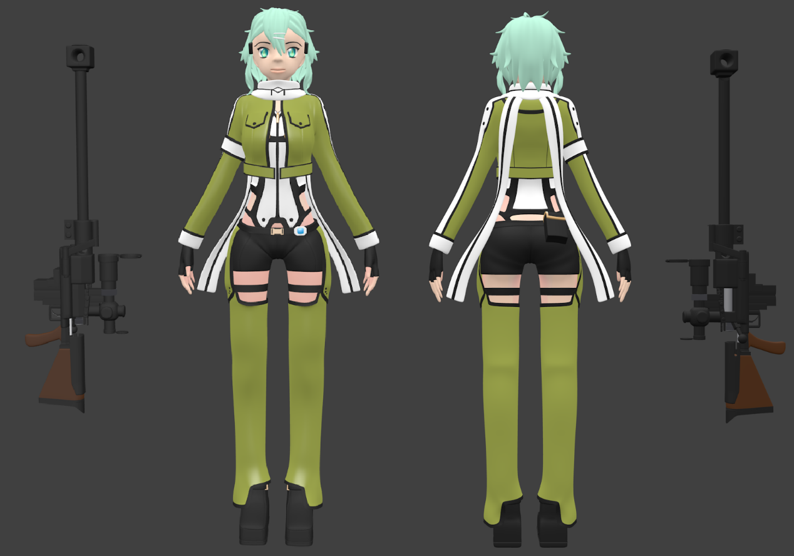
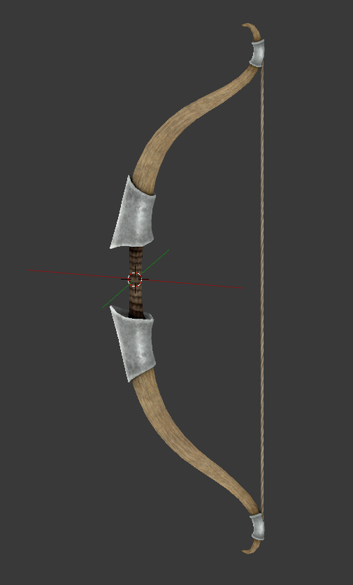
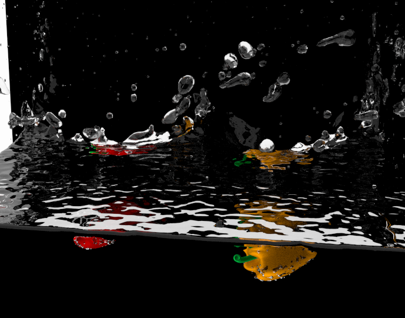
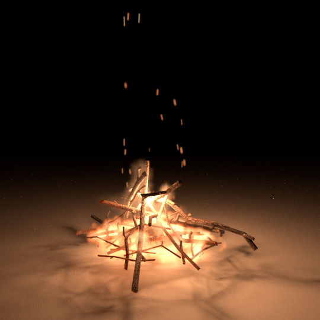
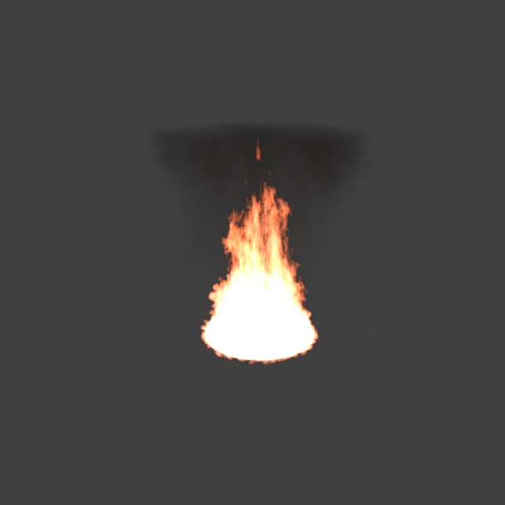
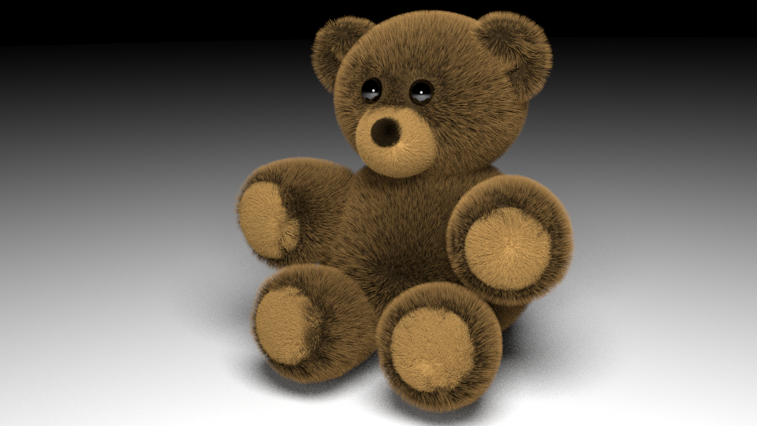
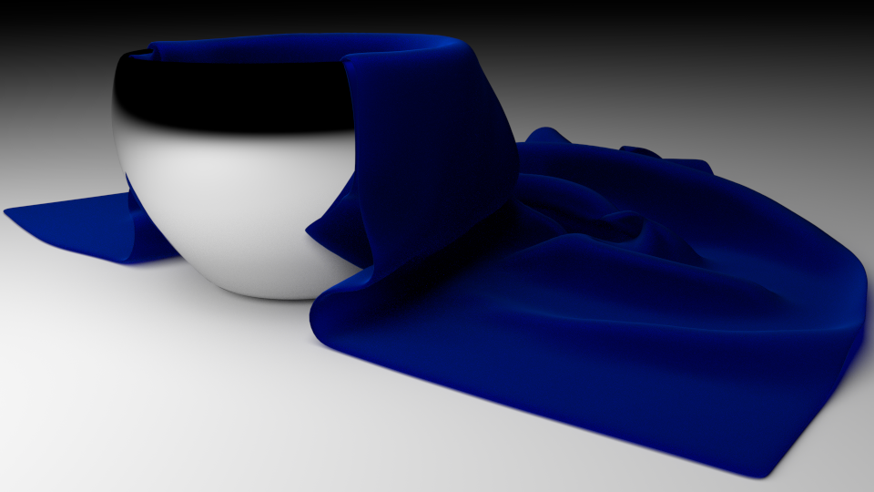
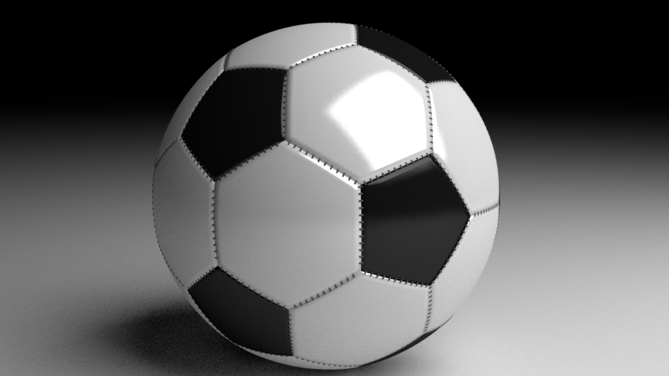
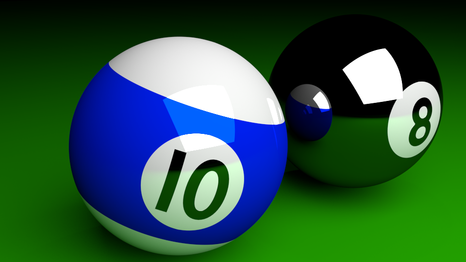
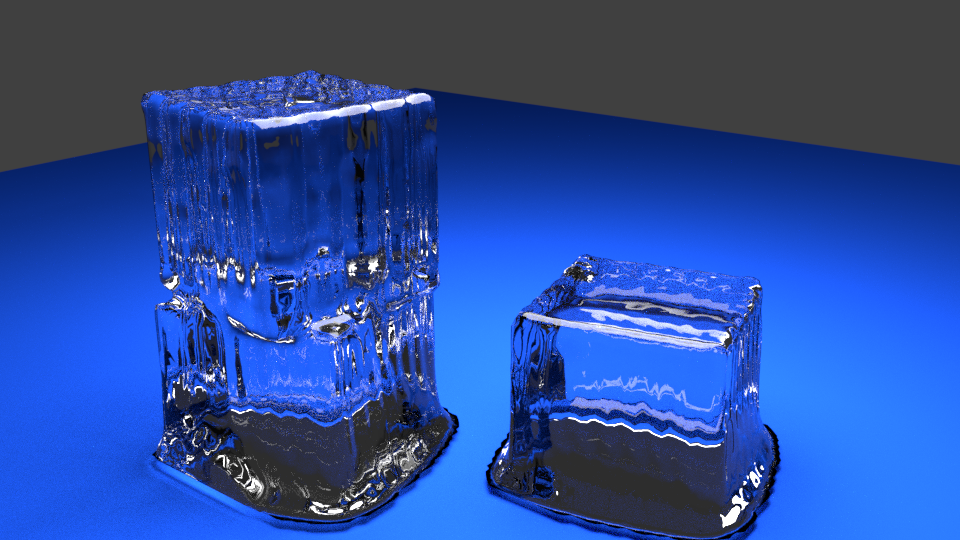

# 3D Modeling & Animation

I used Blender as my main tools, sometimes I used 3ds Max instead.

Feel free to visit my Sketchfab: <https://sketchfab.com/mopackp>.

## Character Modeling

* I make 3d characters by using these methods: Mesh Editing, Sculpting, Mapping (Material, Texture, Bump Map), Rigging (Armature & Constraints), Weight Painting and Animation (Keyframe & Shape Keys).

* SAO Sinon, one of my 3d character art work:

* A Bow, Rigging as an arrow-shooting weapon. You can watch the animation at BGEGameDesign/BowAndArrow.

## Physics Effects & Post Processings

* Physics Effects: I've try to use Particle Systems (Hair & Emitter), Cloth, Fluid, Fire & Smoke, Collision and Wind effects.

* Post Processing: Glassy, Blur, Mixing Shader (Add & Multiply) and Color Ramp are the post processings I used most.

* Fluid: 

* Fire & Smoke:

* Particle Systems (Hair & Emitter):

* Glassy & Blur:

## Animation

* Apache Girl:

* Muscle Man Idle:

* Fire Burning:

