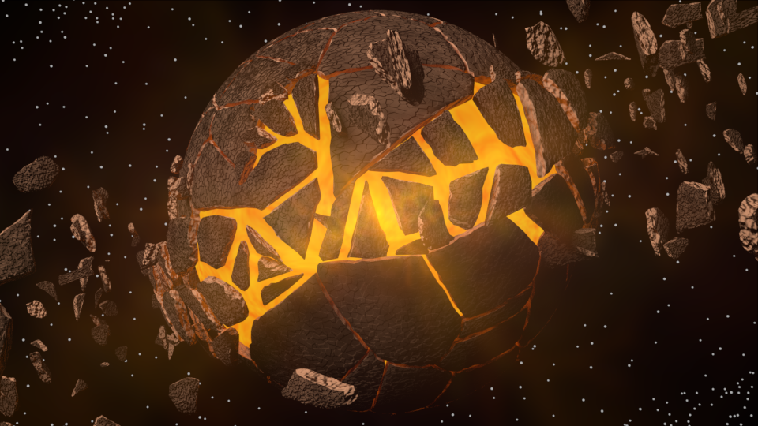
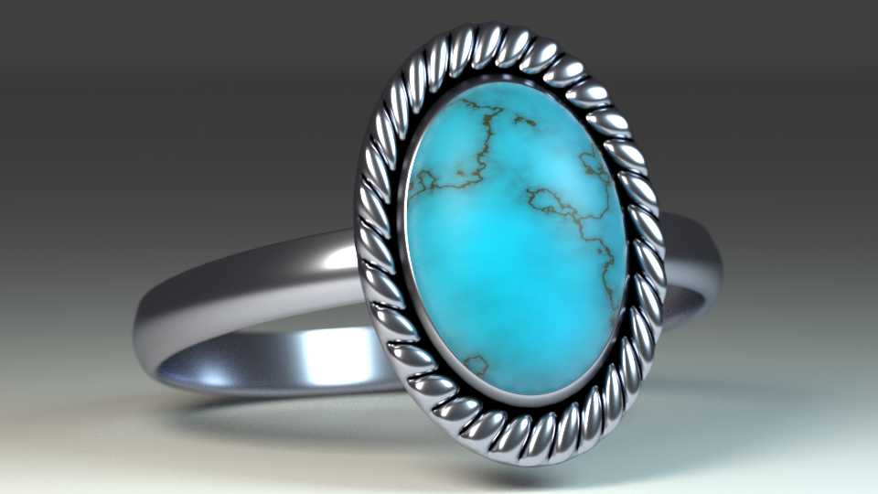

# 3D Modeling & Animation

I used Blender as my main tools, sometimes I used 3ds Max instead.

Feel free to visit my Sketchfab: <https://sketchfab.com/mopackp>.

## Character Modeling

* I make 3d characters by using these methods: Mesh Editing, Sculpting, Mapping (Material, Texture, Bump Map), Rigging (Armature & Constraints), Weight Painting and Animation (Keyframe & Shape Keys).

* SAO Sinon, one of my 3d character art work:


## Physics Effects & Post Processings

* Physics Effects: I've try to use Particle Systems (Hair & Emitter), Cloth, Fluid, Fire & Smoke, Collision and Wind effects.

* Post Processing: Glassy, Blur, Mixing Shader (Add & Multiply) and Color Ramp are the post processings I used most.

* Fluid: 


* Fire & Smoke:


* Particle Systems (Hair & Emitter):




* Glassy & Blur:





## Animation

* Apache Girl:
Watch my apache girl on Youtube.

[](https://www.youtube.com/watch?v=iAz-1SeMezM)


* Muscle Man Idle:

<video width="320" height="240" controls>
  <source src="Images/MuscleManIdle.avi" type="video/avi">
</video>

<video id="video1" width="854">
    <source src="Images/MuscleManIdle.avi" type="video/avi">
    Your browser does not support HTML5 video.
</video>
<br><br>
<button class="btn" onclick="playPause()">Play/Pause</button>


```js
    var myVideo = document.getElementById("video1");
    function playPause() {
        if (myVideo.paused)
            myVideo.play();
        else
            myVideo.pause();
    }
```
* Bow Shooting: